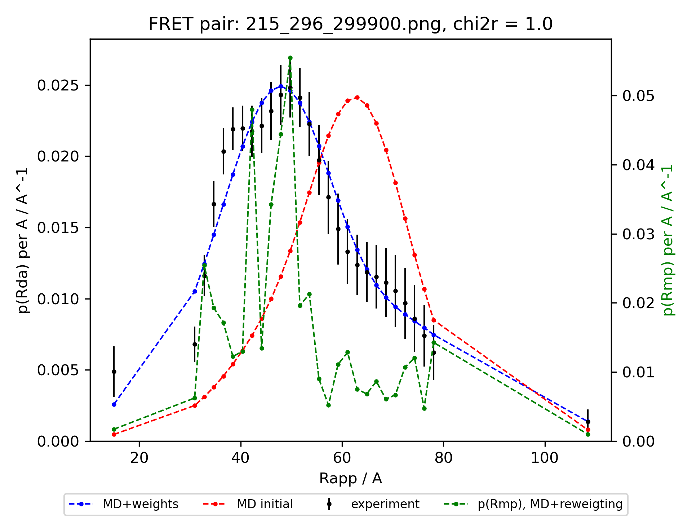

# MaxEnt-pRda
Maximum Entropy (MEM) re-weighting of conformational ensembles directed by the inter-dye distance distributions derived from FRET experiments.

## Usage

```
./optimize_lif_mem.py 300000 "Lif_data/MD_Milana_Lif_ff99sb-disp/results" 0.16
```
First argument (`300000`) is the maximum number of optimization iterations.
Second argument is the path to the directory to save the results (`"Lif_data/MD_Neha_pre2021/results"`).
Third argument (`0.16`) is `θ`. θ is the tuning parameter that allows to chose the relative weight of `χ2` and entropy (`S`). For `θ = 0` the entropy is ignored and the algorithm minimizes the `χ2`, for `θ = +∞`, `χ2` is ignored and no reweighing can happen since the original weights are fully preserved.
This example runs MEM optimization with `300000` steps and `θ = 0.16`. The results are saved in the `Lif_data/MD_Milana_Lif_ff99sb-disp/results` directory. The conformational ensemble consists of 5558 structures and the optimization takes ~15 minutes and 4.5 GB of RAM on a desktop PC.
The results include the [optimized cluster weights](Lif_data/MD_Milana_Lif_ff99sb-disp/results/weights_final.dat), [optimized inter-dye distance distributions](Lif_data/MD_Milana_Lif_ff99sb-disp/results/pRda_model_215_296.dat), and corresponding plots for each FRET pair.


