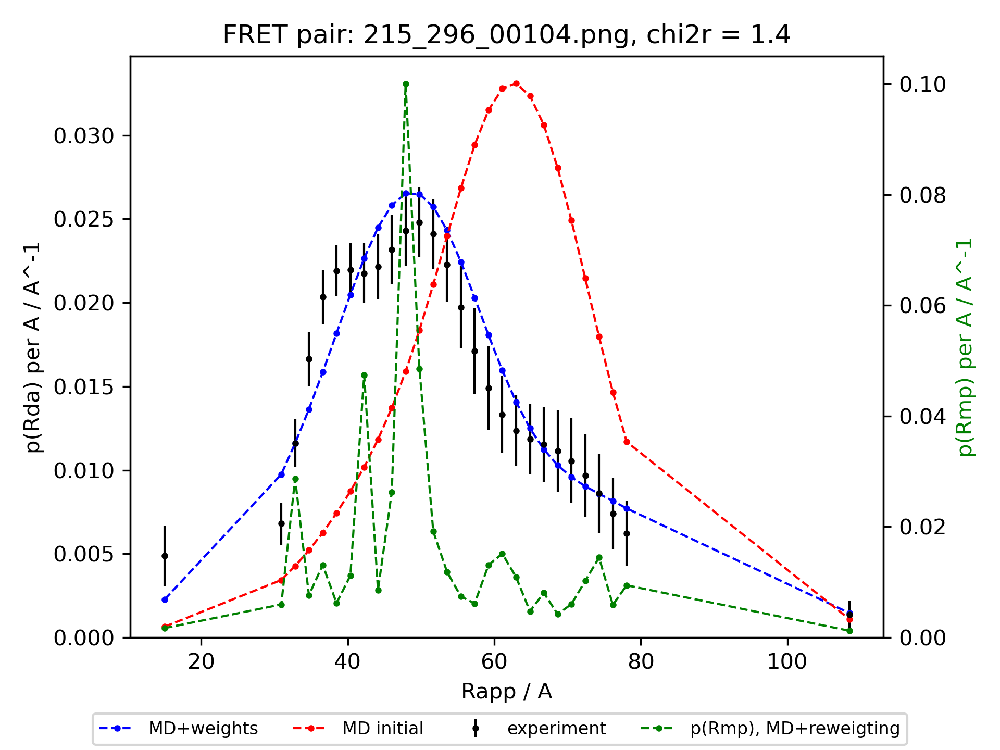

# MaxEnt-pRda
Maximum Entropy (MEM) re-weighting of conformational ensembles directed by the inter-dye distance distributions derived from FRET experiments.

## Usage

```
./maxent.py \
--exp 'Lif_data/ucfret_20201210/*.txt' \
--weights 'Lif_data/MD_Milana_Lif_ff99sb-disp/cluster_weights.dat' \
--rmps 'Lif_data/MD_Milana_Lif_ff99sb-disp/Rmp.dat' \
--out 'Lif_data/MD_Milana_Lif_ff99sb-disp/result' \
--theta 0.31
```
First argument (`--exp`) is the path pattern for experimental data files. `--weigths` is the path to the file with reference conformer weights. `--rmps` is the path to the data file, which contains distance between mean positions (Rmp) for all conformers. `--out` is the path to the directory to save the results.
Last argument (`0.31`) is `θ`. `θ` is the tuning parameter that allows to chose the relative weight of `χ2` and entropy (`S`). For `θ = 0` the entropy is ignored and the algorithm minimizes the `χ2`, for `θ = +∞`, `χ2` is ignored and no reweighing can happen since the original weights are fully preserved. Description of command-line arguments is also available via `./maxent.py -h`.
An example of results is available at `Lif_data/MD_Milana_Lif_ff99sb-disp/result` directory.
The results include the [optimized cluster weights](Lif_data/MD_Milana_Lif_ff99sb-disp/result/weights_final.dat), [optimized inter-dye distance distributions](Lif_data/MD_Milana_Lif_ff99sb-disp/result/pRda_reweighted.dat), and corresponding plots for each FRET pair.




More information about the Maximum Entropy Method in the context of conformational ensembles can be found in the following [publication](https://doi.org/10.1007/978-1-4939-9608-7_14):
> Köfinger J, Różycki B, Hummer G. Inferring structural ensembles of flexible and dynamic macromolecules using Bayesian, maximum entropy, and minimal-ensemble refinement methods. InBiomolecular Simulations 2019 (pp. 341-352). Humana, New York, NY.
